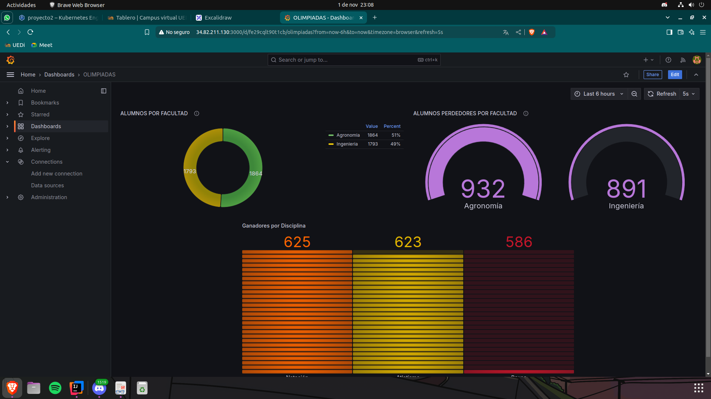
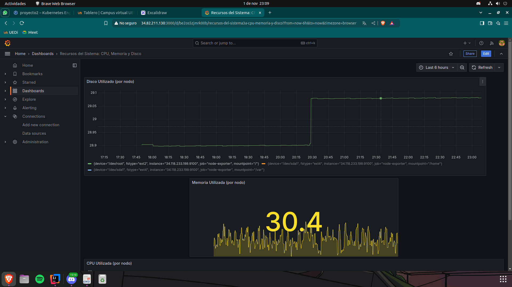
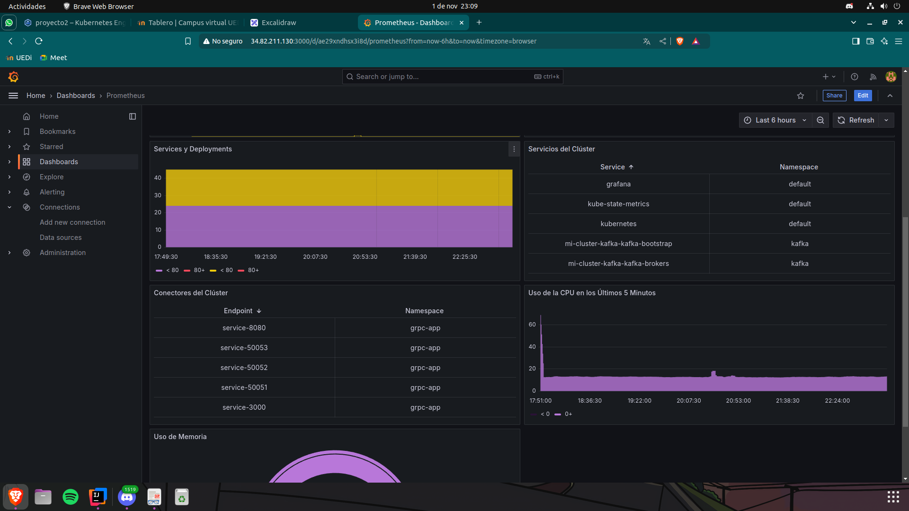

# Proyecto 2 Sistemas Operativos 1
# Manual Técnico: Instalación y Uso del Proyecto
## Introducción

Este proyecto implementa un sistema en Google Cloud Platform (GCP) con Google Kubernetes Engine (GKE) para monitorear en tiempo real las Olimpiadas de la Universidad de San Carlos de Guatemala. Con Kubernetes y contenedores, se despliega una arquitectura en la nube que soporta grandes volúmenes de tráfico generado por los competidores de Ingeniería y Agronomía en Natación, Boxeo y Atletismo.

Kafka y Redis gestionan el flujo de datos y el almacenamiento en tiempo real de los puntajes, mientras que Grafana proporciona visualización de los resultados y el conteo de medallas por facultad. Este sistema asegura escalabilidad y permite el análisis de datos en tiempo real, mostrando el rendimiento de cada facultad en dashboards interactivos.

---

## Requisitos Previos


- **Docker** instalado y funcionando en tu sistema. Verifica la instalación usando docker --version y asegúrate de tener la sesión iniciada para subir imágenes a Docker Hub.
- **Python 3** con las dependencias necesarias, idealmente gestionadas con venv o pipenv.
- **Rust** instalado y configurado. Verifica la instalación con rustc --version.
- **Go** instalado, con GOPATH configurado correctamente. Verifica la instalación con go version.
- **kubectl** instalado para gestionar recursos en Kubernetes. Confirma la instalación con kubectl version --client.
- **Helm** para administrar paquetes en Kubernetes. Instala y verifica la versión con helm version.
- **Permisos** de administrador (sudo) para ejecutar algunos comandos que requieran privilegios elevados.

## Tecnologias Utilizadas

### Kubernetes
Kubernetes es un sistema de orquestación de contenedores que automatiza la implementación, escalado y gestión de aplicaciones en contenedores. Permite agrupar contenedores en unidades llamadas **pods**, gestiona el ciclo de vida de las aplicaciones y ofrece características como balanceo de carga, autoescalado y recuperación ante fallos.

### Locust
Locust es una herramienta de carga y rendimiento para probar aplicaciones web. Permite simular múltiples usuarios concurrentes que realizan acciones en la aplicación, lo que ayuda a identificar cuellos de botella y evaluar el rendimiento bajo diferentes cargas. Los scripts de prueba se escriben en Python, facilitando la personalización de las pruebas.

### Cliente - Servidor (gRPC + Golang)
gRPC es un marco de trabajo de comunicación de alto rendimiento que utiliza HTTP/2 para la transmisión de datos y Protocol Buffers como formato de serialización. Permite la creación de servicios que pueden comunicarse entre sí, facilitando la construcción de aplicaciones distribuidas. Golang es un lenguaje ideal para gRPC debido a su eficiencia y facilidad de uso para el desarrollo de servicios concurrentes.

### Kafka (con Strimzi)
Apache Kafka es una plataforma de mensajería distribuida que permite la transmisión de datos en tiempo real. Se utiliza para construir sistemas de procesamiento de datos en streaming y gestionar flujos de datos entre productores y consumidores. Strimzi es un operador de Kubernetes que simplifica la implementación y gestión de clústeres de Kafka en entornos de Kubernetes, facilitando la configuración y el mantenimiento.

### Consumidor (Golang)
El consumidor en Golang es un componente que recibe mensajes de Kafka. Utiliza bibliotecas específicas (como `github.com/segmentio/kafka-go`) para conectarse a los temas de Kafka y procesar los mensajes, que pueden ser datos de eventos, actualizaciones o cualquier información relevante que se desee consumir y almacenar, por ejemplo, en Redis.

### Redis
Redis es una base de datos en memoria, clave-valor, de alto rendimiento que se utiliza para el almacenamiento temporal de datos. Proporciona operaciones rápidas y eficientes, lo que la hace ideal para almacenar datos que requieren acceso rápido, como sesiones de usuario, resultados de cálculos y datos de aplicaciones en tiempo real.

### Grafana
Grafana es una plataforma de visualización y análisis de datos que permite crear dashboards interactivos. Se utiliza para monitorear y visualizar métricas y datos de diferentes fuentes, incluyendo bases de datos y sistemas de monitoreo. Grafana permite crear visualizaciones personalizadas y alertas basadas en métricas definidas.

### Prometheus
Prometheus es un sistema de monitoreo y alerta diseñado para recopilar y almacenar métricas en tiempo real. Utiliza un modelo de datos basado en series temporales y un lenguaje de consulta específico (PromQL) para extraer y manipular datos. Es ampliamente utilizado en entornos de microservicios y se integra fácilmente con Kubernetes para monitorear la salud de aplicaciones y servicios.

## Descripcion de Deployments

### namespace.yaml

Este archivo define un namespace en Kubernetes llamado `grpc-app`. Los namespaces son una forma de organizar y aislar recursos dentro de un clúster de Kubernetes, permitiendo agrupar objetos relacionados y gestionar permisos y recursos de manera más eficiente.

Al utilizar el namespace `grpc-app`, se facilita la separación de los recursos utilizados por la aplicación gRPC y sus servicios asociados de otros recursos que puedan existir en el clúster. Esto ayuda a evitar conflictos de nombres y a implementar políticas de acceso específicas para los diferentes entornos de trabajo, como desarrollo, pruebas y producción.


### client-agronomia-grpc.yaml / client-ingenieria-grpc.yaml

Este archivo define un Deployment que implementa un cliente gRPC en un pod dentro del namespace `grpc-app`. El cliente, desarrollado en Go, recibe datos desde el exterior y los procesa para enviarlos a un servidor gRPC, que también está escrito en Go. Este servidor, a su vez, produce eventos que se envían a Kafka.

El Deployment incluye un Service de tipo `LoadBalancer`, lo que permite acceder al cliente gRPC desde fuera del clúster, facilitando la interacción con otros servicios y clientes externos. A través del Service, se habilita el acceso al puerto 3000 del cliente, asegurando que el tráfico externo pueda ser dirigido al pod adecuado dentro del clúster.

Además, el uso de un LoadBalancer permite la escalabilidad y la gestión del tráfico entrante, mejorando la resiliencia de la aplicación en un entorno de producción.

[Ejemplo del archivo yaml](../Proyecto2/kubeless/client-agronomia-grpc.yaml)

### kafka-cluster.yaml
Este archivo define un clúster de Kafka utilizando el operador Strimzi. El clúster es responsable de manejar la mensajería entre los diferentes servicios de la aplicación, asegurando que los eventos producidos por los servidores gRPC sean almacenados y distribuidos de manera eficiente.

El uso de Kafka permite la creación de sistemas desacoplados, donde los productores (servidores gRPC) y los consumidores (aplicaciones que procesan los datos) pueden operar de manera independiente, lo que mejora la escalabilidad y la resiliencia del sistema.

Ejemplo:
```yaml
apiVersion: kafka.strimzi.io/v1beta2
kind: Kafka
metadata:
  name: my-cluster
  namespace: kafka
spec:
  kafka:
    version: 2.8.0
    replicas: 3
    listeners:
      plain: {}
      tls: {}
    storage:
      type: persistent-claim
      size: 100Gi
  zookeeper:
    replicas: 3
    storage:
      type: persistent-claim
      size: 100Gi
```

### Topics-kafka.yaml
Este archivo define los topics que serán utilizados por el clúster de Kafka. Los topics son los canales a través de los cuales los productores envían mensajes y los consumidores los leen. Definir adecuadamente los topics es esencial para garantizar que los datos fluyan correctamente entre los diferentes componentes de la aplicación.

Los topics deben estar alineados con los eventos que se desean procesar, permitiendo a los consumidores filtrar y manejar la información de manera eficiente

```yaml
apiVersion: kafka.strimzi.io/v1beta2
kind: KafkaTopic
metadata:
  name: winners
  namespace: kafka
spec:
  partitions: 3
  replicas: 3
---
apiVersion: kafka.strimzi.io/v1beta2
kind: KafkaTopic
metadata:
  name: losers
  namespace: kafka
spec:
  partitions: 3
  replicas: 3

```

### Server para athletics, boxing y swimming
Estos archivos definen los deployments de los servidores gRPC que recibirán los datos de los clientes. Cada servidor está diseñado para manejar un tipo específico de evento (Atletismo, Boxeo y Natación) y produce eventos que se envían a Kafka. Al igual que los clientes, estos servidores están implementados en Go y permiten la escalabilidad mediante el uso de pods.

La implementación de los servidores gRPC es fundamental para el procesamiento de los datos y la integración con el sistema de mensajería de Kafka.

```yaml
apiVersion: apps/v1
kind: Deployment
metadata:
  name: server-athletics-grpc
  namespace: grpc-app
spec:
  replicas: 1
  selector:
    matchLabels:
      app: server-athletics-grpc
  template:
    metadata:
      labels:
        app: server-athletics-grpc
    spec:
      containers:
        - name: server-athletics-grpc
          image: allangomez/server-athletics:v0.0
          ports:
            - containerPort: 50051

```

### Consumer para winners y losers
Estos archivos definen los deployments de los consumidores que procesarán los eventos producidos en los topics de Kafka. Cada consumidor está diseñado para recibir y manejar los eventos correspondientes, asegurando que la información se almacene y se procese correctamente. Estos consumidores son implementados en Go y se conectan al clúster de Kafka para recibir mensajes en tiempo real.

```yaml
apiVersion: apps/v1
kind: Deployment
metadata:
  name: consumer-losers
  namespace: grpc-app
spec:
  replicas: 1
  selector:
    matchLabels:
      app: consumer-losers
  template:
    metadata:
      labels:
        app: consumer-losers
    spec:
      containers:
        - name: consumer-losers
          image: allangomez/consumer-losers:v0.0 # imagen de docker
```

### HPA (Escalador Automático de Pods)
Estos archivos definen los Horizontal Pod Autoscalers (HPA) para los clientes y servidores. El HPA ajusta automáticamente el número de pods en función de la carga de trabajo, asegurando que la aplicación pueda escalar de manera eficiente en respuesta a cambios en la demanda. Esta capacidad de escalado dinámico es esencial para mantener el rendimiento y la disponibilidad en un entorno de producción.

Ej:
```yaml
apiVersion: apps/v1
kind: Deployment
metadata:
  name: consumer-losers
  namespace: grpc-app
spec:
  replicas: 1
  selector:
    matchLabels:
      app: consumer-losers
  template:
    metadata:
      labels:
        app: consumer-losers
    spec:
      containers:
        - name: consumer-losers
          image: allangomez/consumer-losers:v0.0

```

### Ingress
Este archivo configura el Ingress para manejar el tráfico externo y dirigirlo a los servicios apropiados dentro del clúster. El Ingress permite gestionar las rutas y los accesos a los diferentes servicios, facilitando la comunicación entre la aplicación y el exterior. Esta configuración es clave para exponer los servicios de manera segura y eficiente.

Ej:
```yaml
apiVersion: networking.k8s.io/v1
kind: Ingress
metadata:
  name: grpc-ingress
  namespace: grpc-app
spec:
  rules:
  - host: grpc.example.com
    http:
      paths:
      - path: / 
        pathType: Prefix
        backend:
          service:
            name: service-3000
            port:
              number: 3000

```


## Flujo de Implementación de los Archivos YAML

El flujo de implementación de los archivos YAML en el clúster de Kubernetes fue el siguiente:

1. **Creación del Namespace**: Se creó el namespace `grpc-app` para aislar y organizar todos los recursos relacionados con la aplicación gRPC.
   ```bash
   kubectl apply -f namespace.yaml
    ```
2. **Despliegue de Clientes**: Se implementaron los clientes gRPC para Agronomía e Ingeniería en pods separados, cada uno con su propio Deployment y Service.
    ```bash
    kubectl apply -f client-agronomia-grpc.yaml
    kubectl apply -f client-ingenieria-grpc.yaml
     ```
3. **Instalación de Kafka**: Se creó un namespace para Kafka y se instaló el operador de Strimzi para gestionar el clúster de Kafka.
    ```bash
    kubectl create namespace kafka
    kubectl create -f 'https://strimzi.io/install/latest?namespace=kafka' -n kafka
     ```
4. **Despliegue del Clúster de Kafka**: Se creó el clúster de Kafka y se configuraron los topics necesarios.
    ```bash
    kubectl apply -f kafka-cluster.yaml
    kubectl apply -f topics-kafka.yaml
     ```
5. **Despliegue de Servidores gRPC**: Se implementaron los servidores gRPC para Atletismo, Boxeo y Natación en pods separados, cada uno con su propio Deployment y Service.
    ```bash
    kubectl apply -f server-athletics-grpc.yaml
    kubectl apply -f server-boxing-grpc.yaml
    kubectl apply -f server-swimming-grpc.yaml
     ```
6. **Instalación de Redis con Helm**: Se instaló Redis utilizando Helm para gestionar los paquetes y configuraciones necesarias.
    ```bash
    curl https://raw.githubusercontent.com/helm/helm/main/scripts/get-helm-3 | bash
    helm repo add bitnami https://charts.bitnami.com/bitnami
    helm repo update
    helm install redis-release bitnami/redis
     ```
7. **Despliegue de los Consumidores de Kafka**: Se implementaron los consumidores que procesarán los eventos producidos en Kafka.
    ```bash
    kubectl apply -f consumer-losers.yaml
    kubectl apply -f consumer-winners.yaml
     ```
8. **Configuración del Horizontal Pod Autoscaler (HPA)**: Se configuró el HPA para gestionar automáticamente la escalabilidad de los clientes y servidores según la carga de trabajo.
    ```bash
    kubectl apply -f HPA-client.yaml
    kubectl apply -f HPA-server.yaml
     ```  
9. **Creación de los Servicios de Grafana y Prometheus**: Se implementaron los servicios de Grafana y Prometheus para monitorear y visualizar los datos y métricas de la aplicación, y para ello se debe instalar en el cluster de Kubernetes.
    ```bash
    helm repo add bitnami https://charts.bitnami.com/bitnami
    helm repo update
    helm install grafana bitnami/grafana --set plugins="redis-datasource" --set security.allowEmbedding=true --set service.type=LoadBalancer --set http.cors.allowOrigins=http://localhost:3000 --namespace default
     ```
10. Recuperar contraseña de grafana
    ```bash
    echo "Password: $(kubectl get secret grafana-admin --namespace default -o jsonpath="{.data.GF_SECURITY_ADMIN_PASSWORD}" | base64 -d)"
    ```
11. **Instalar prometheus**: Se instala prometheus para monitorear los servicios de la aplicacion.
    ```bash
    helm install prometheus bitnami/prometheus --namespace default
    helm install kube-state-metrics bitnami/kube-state-metrics
    helm install node-exporter bitnami/node-exporter
    ```
12. **Ejemplo de las capturas de los dashboards de Grafana**

Dashboard 1: Visualizacion de ganadores y perdedores


Dashboard 2: Visualizacion de recursos de los pods
    



---
Allan Gómez - 202005035