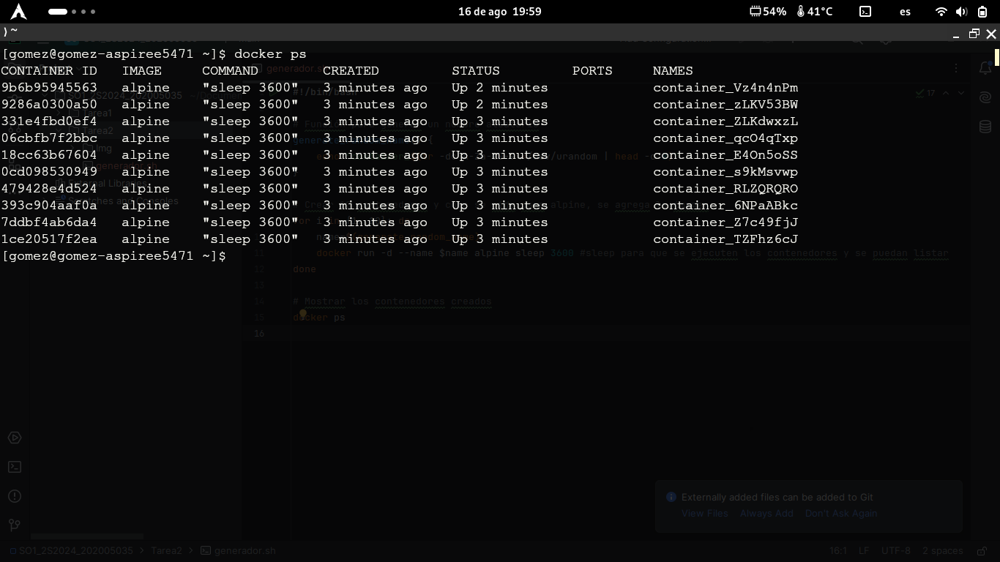

## Creación de Contenedores Docker con Nombres Aleatorios

Este documento proporciona instrucciones paso a paso para crear y ejecutar un script de Bash que genera 10 contenedores Docker utilizando la imagen `alpine`, asignándoles nombres aleatorios.

### Requisitos Previos

- **Docker** instalado en tu sistema.
```bash
sudo pacman -S docker
```
- Usuario agregado al grupo `docker` (si no, deberás usar `sudo` con los comandos de Docker).
```bash
sudo usermod -aG docker $USER
```

## Instrucciones
### 1. Crear el Script de Bash

1. Abre una terminal y crea un archivo llamado `generador.sh`:
   ```bash
   touch generador.sh
   ```
2. Edita el archivo con el editor de texto que prefieras o el IDE que mas disfrutes usar, el archivo debera estar asi:
[generador.sh](https://github.com/allangomez72/SO1_2S2024_202005035/blob/main/Tarea2/generador.sh)
3. Guarda el archivo y cerrar el editor

### 2. Hacer el script ejecutable
Desde la terminal se le deben de dar permisos:
```bash
chmod +x generador.sh
```
### 3. Ejecutar el script
Ejecuta el script para crear los contenedores y mostrar los resultados
```bash
 ./generador.sh
```
El comando ejecutara el script y se generaran los 10 contenedores y se podran visualizar en la consola el nombre de cada uno de ellos por medio de la lista de contenedores en ejecucion.

```bash
docker ps
```

La vista de los contenedores desde la consola se veria de la siguiente manera:


